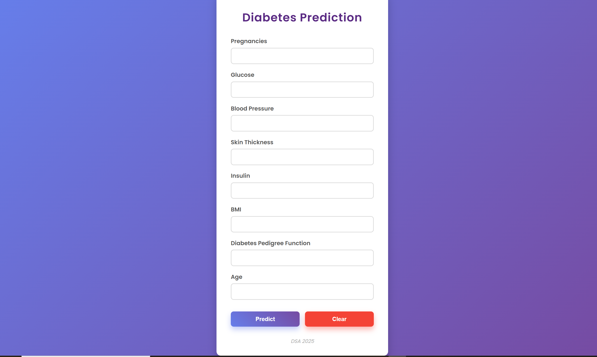

# diabetes-predictor-app
# 🩺 Diabetes Prediction Web App

This repository contains a machine learning-powered web application that predicts whether a person is likely to have diabetes based on medical data. The app is built using **Flask**, and demonstrates both front-end and back-end deployment capabilities.

---

## 🔍 Project Overview

Diabetes is a major health issue globally. This application provides an easy-to-use interface for early detection using machine learning. Users input health parameters, and the trained model returns a prediction.

---

## 🚀 Features

- 🧠 Trained Machine Learning model using scikit-learn
- 🌐 front-end option:  Flask
- 📈 Real-time predictions based on user input
- 📊 Simple, intuitive UI for non-technical users

  

---

## 🗃️ Dataset

- Source: [Pima Indians Diabetes Dataset](https://www.kaggle.com/datasets/uciml/pima-indians-diabetes-database)
- Features:
  - Pregnancies
  - Glucose
  - Blood Pressure
  - Skin Thickness
  - Insulin
  - BMI
  - Diabetes Pedigree Function
  - Age
  - Outcome (Label)

---

## 🛠️ Tech Stack

- Python 🐍
- Flask
- scikit-learn
- pandas
- joblib
- HTML/CSS (for Flask UI)

---

## 📁 File Structure

